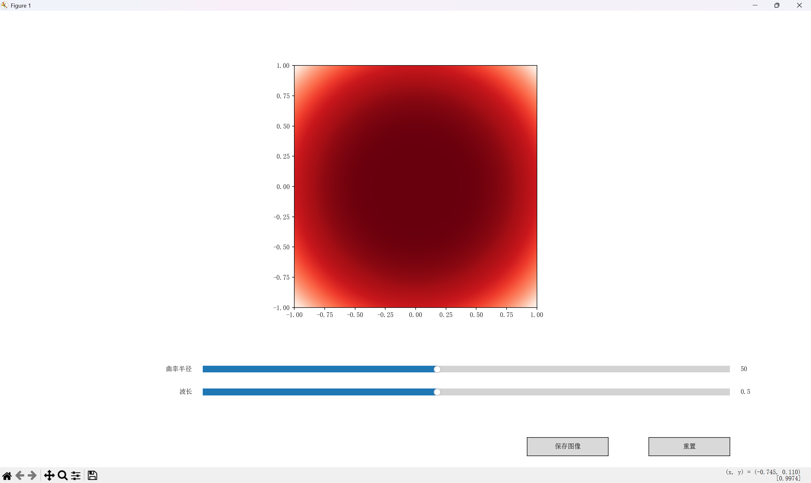

# 牛顿环图像生成与可视化工具

## 项目简介

该项目实现了牛顿环图像的生成与可视化，允许用户通过滑动条调整曲率半径和波长来动态生成不同的牛顿环干涉图案。项目还包含了一个图形界面，基于`matplotlib`和`tkinter`库，提供了良好的交互体验。

## 功能

- **动态生成牛顿环图像**：通过调整曲率半径和波长生成不同的牛顿环干涉图案。
- **交互式控制**：使用滑块实时控制图像的变化。
- **图像保存**：允许用户将当前的图像保存为 PNG 格式。
- **重置功能**：可以快速重置所有滑块到默认值，恢复原始状态。

## 使用方法

### 环境要求

无需安装 Python 或任何依赖，直接下载打包好的可执行文件即可运行。

### 下载链接

前往 [Releases 页面](https://github.com/XXYoLoong/newton_rings_project/releases) 下载最新版本的可执行文件。

### 步骤

1. 下载打包好的可执行文件：
   [点击这里](https://github.com/XXYoLoong/newton_rings_project/releases) 获取最新版。

2. 双击运行：
   直接双击运行 `newton rings project.exe` 即可启动程序。

3. 使用界面：
   - 使用滑块调整 `曲率半径` 和 `波长`。
   - 点击 **保存图像** 按钮保存当前图像。
   - 点击 **重置** 按钮恢复到默认设置。

## 开发与打包说明（开发者专用）

如果想要修改或扩展功能，可以按照下列步骤运行源码并重新打包：

1. 安装 Python 和依赖：
   ```bash
   pip install numpy matplotlib
   ```

2. 运行源码：
   ```bash
   python main.py
   ```

3. 打包为可执行文件：
   使用 PyInstaller 将代码打包：
   ```bash
   pyinstaller --onefile --version-file=version.txt main.py
   ```

   打包完成后，`.exe` 文件会生成在 `dist` 文件夹中。

## 示例截图

（项目截图）

## 许可证

本项目使用 [Apache 2.0 许可证](http://www.apache.org/licenses/LICENSE-2.0)。

## 开源贡献

欢迎任何形式的贡献，包括提交 bug 修复、功能请求或代码改进。请确保在提交 PR 之前通过 [issues](https://github.com/XXYoLoong/newton_rings_project/issues) 提出讨论。

### 贡献步骤

1. Fork 本仓库
2. 创建新的分支 (`git checkout -b feature-xyz`)
3. 提交更改 (`git commit -am 'Add feature xyz'`)
4. 推送到分支 (`git push origin feature-xyz`)
5. 提交 Pull Request

## 联系信息

如有任何问题或建议，请通过以下方式联系：

- 邮箱：chayunyolong@gmail.com
- GitHub 个人主页：([XXYoLoong (Jiacheng Ni)](https://github.com/XXYoLoong))

